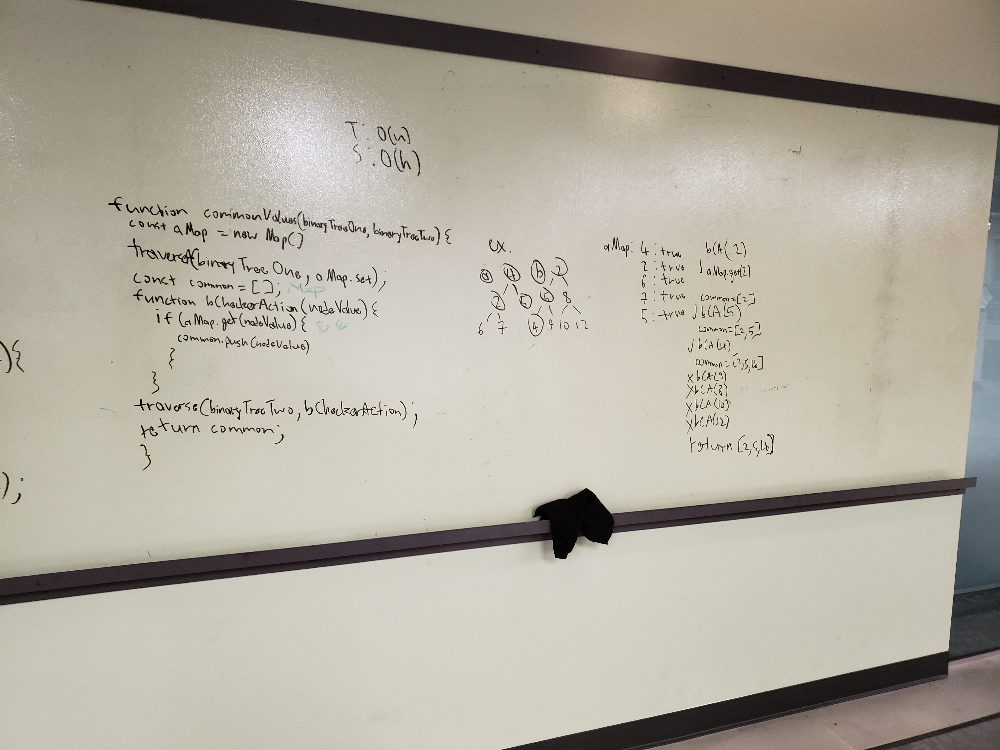

 Code Challenge 27: Common Tree Values
===
;
;

## Overview
Function that takes in two binary trees and returns the common values between them.

## Usage
Requires: NodeJS and NPM (as well as git).

Clone repo down into a folder, then `npm install` or `yarn i`. 

run tests with `npm run test`. 

## Built With
- Node.js 
- Eslint
- Jest

## Author

Diego Ramos
