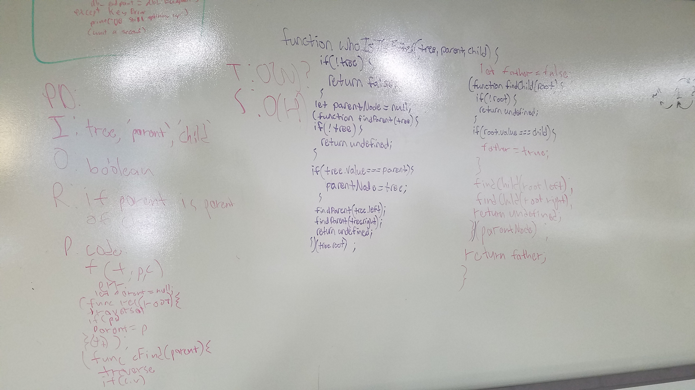

 Code Challenge 28: Is This The Child?
===

## Overview
Function that takes in a binary tree, a 'parent' value, and a 'child' value and returns whether or not that child is the descendant of that parent as a boolean.

## Solution
Create two recursive IIFEs that represent the two phases of the problem; finding the parent node, and then traversing from that parent node looking for the child and returning true if the child indeed exists.

## Usage
Requires: NodeJS and NPM (as well as git).

Clone repo down into a folder, then `npm install` or `yarn i`. 

run tests with `npm run test`. 

## Built With
- Node.js 
- Eslint
- Jest

## Author

Diego Ramos
Tyler Anyan
